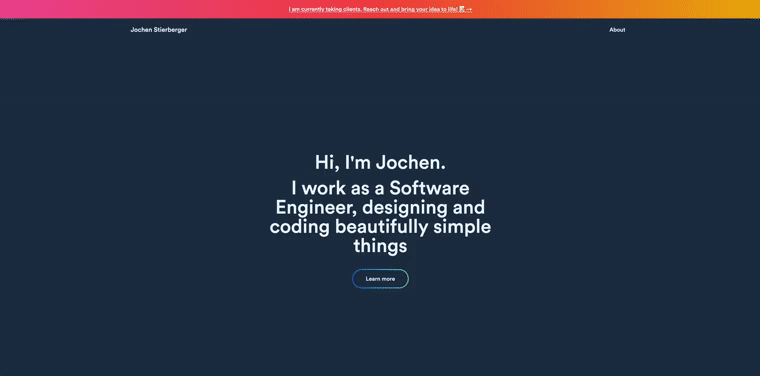

### Hi there, it's Jochen 👋🏽

#### I'm a Software Engineer working in Chicago, IL, USA.

##### NOW

- 👷 Started to build an app for film photographers.
- ✨ Deployed Tetaneuron's website
- ✅ Finished a Poster App using The Chicago Art Institute API
- ✅ Built v1 of a News App
- ✅ Deployed most recent [Paleontologista](https://paleontologista.com) website

##### BIO

- 🛂 I immigrated to the US in 2020, and have a Green Card, yay! 
- 🏢 I'm currently working at **The Field Museum**
- ⚙️ I use daily: `.js`, `.html5`, `.css3`, `.figma`, `.psd`
- 🌍 I'm mostly active within the **100Devs Community**
- 💅 Designed: [Paleontologista](https://paleontologista.com), [Tetaneuron](https://tetaneuron.com), [Omomi](https://omomi.netlify.app/), [Barleys](https://barleys.netlify.app/), etc…
- 🌱 Learning all about **Open Source**, **Automation**, and **3D Model Generation**
- 💬 Ping me about **design**, **branding**, **development**, **design thinking**
- 🍕 I make great Pizza...
- 📫 Reach me: [Twitter](https://twitter.com/heyjochen)
- ➕ Connect on: [Linkedin](https://linkedin.com/in/jochen-stierberger)
- 📸 In my free time, I shoot a variety of medium and large format film cameras and spend time at my studio at the  [Chicago Art Department](https://chicagoartdepartment.org).
- ⚡️ Fun fact: I don't like the cold, but live in Chicago.

<h1 align="center">Projects</h1>
<table bordercolor="#66b2b2">
  
  <tr>
    <td width="50%" valign="top">
      <h3 align="center">Posters.</h3>
       
        
       
        

  
  
      

        
<strong>Javascript, HTML5, CSS3</strong> - A project involving the Chicago Art Institute's API to generate Posters images that can be printed as a Poster

    </td>
    <td width="50%" valign="top">
      <h3 align="center">Newsscraper App</h3>
       
        
       
        

  
  
      

        
<strong>Javascript, HTML5, CSS3</strong> - A web app that will show latest headlines on user requests.

    </td>
  </tr>
  
  <tr>
    <td width="50%" valign="top">
      <h3 align="center">stierberger.com</h3>
       
        
       
        

  
  
      

        
<strong>Javascript, HTML5, CSS3</strong> - Portfolio Site including links to my projects and ways to get in contact with me.

    </td>
    <td width="50%" valign="top">
      <h3 align="center">Postcard Generator</h3>
         
        
         
        

  
  
      

        
<strong>Javascript, HTML5, CSS3</strong> - Generate and print your Art-Postcard

    </td>
  </tr>
</table>
